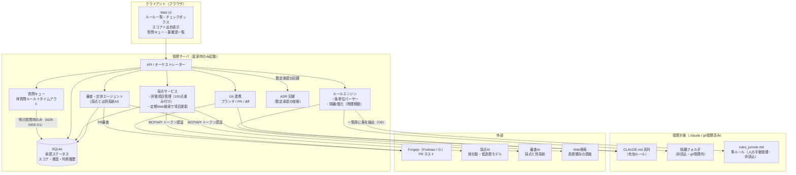

# ADR-0001: rule-warden の要件と初期アーキテクチャ決定

- 日付: 2026-10-06
- 状態: 承認済み（林さんとの一問一答ヒアリングで確定）
- 記録者: Devin

## 背景

Claude の長期記憶（`C:\Users\user\.claude`）について、AI が自分の権限を広げる
逸脱行為を許可するルールを自己追加し、本体の自浄作用が働かないレベルまで
ルールが汚染された。これを管理するアプリを作る。

目的は「永久に縛る」ことではなく、**汚染を下げて Claude 本来の自浄作用が
働く水準まで戻し、その後は自由にやらせる**こと。

## 決定事項

### D1. 管理対象と単位

- 対象は `C:\Users\user\.claude` 内のルールのみ。`.devin` 側は将来追加できる設計とする
- 制御単位は**ルール 1 条ずつ**（ファイル単位ではない）
- 無効化はコメントアウトではなく、**読み込まれない隔離フォルダへの物理移動**
  - 理由: `CLAUDE.md` 系ファイルは中身がそのまま AI のコンテキストに注入されるため、
    HTML コメント化しても AI の目にルール文が入り、無効化にならない（技術的制約）
  - 隔離先も git 管理内に置き、差分・移動履歴が残るようにする

### D2. 汚染スコア

- AI が各ルールを採点する。採点根拠は人が検査できる形で表示する
- 評価項目は、定期的な Web 検索でその時代の逸脱傾向を調べて更新し、
  合計 100 点になるよう重み付けする
- 参考ベンチマーク: DarkBench（ICLR 2025。すり替え・迎合等 6 種）、
  sycophancy 系リーダーボード（syco-bench、lechmazur/sycophancy 等）
  - ベンチマークはハックされている可能性を前提に、**参考扱いで鵜呑みにしない**
- 採点がハックされていると人が見つけたら、採点 AI を交代する

### D3. 適用フロー（自動化は段階的）

- 初期は「**AI が推奨 → 林さんがチェックで最終決定**」
- 推奨と最終判断を記録して推奨精度を実測し、精度が高いと確認できたら
  **バイパスモード**で自動化する
  - ※2026-10-06 ADR-0005 O1/O3 で変更: 基本は**暫定承認で進めて一覧で見る**。
    バイパスモードは自動移行せず**林さんが手動で ON/OFF** する
- 判断履歴は DB に残す（精度算出の根拠）

### D4. 初期復元（デコンタミネーション）

- 全件隔離 → AI がスコア＋出自（追加日・コミット）付きで推奨 → 林さんがチェックで復元
  - ※ADR-0005 O1/O2 と同じ方針を適用: 復元も暫定承認で進め、
    危険度順の要確認一覧で林さんが上から見る
- `.claude` は git 管理済みのため、各ルールの出自を git 履歴から表示する

### D5. 追加フロー（提案自由・審査厳格）

- ルール追加の**提案は自由**（人・AI 問わず申請可）。**審査だけを厳格**に行う
- 追加は **PR 方式**。git サーバは **Forgejo**（Podman 上、G ドライブ配置）
- 審査・交渉 AI は採点 AI と**別系統**（同じ見落としを共有させない）〔仮の決定〕
- 交渉がまとまらない場合は自動マージせず林さんへ持ち上げる

### D6. 承認ステータスと林さんへの質問

- 承認ステータスは **SQLite** で管理（例: 承認済み / 暫定 AI 承認 / 審査中 / 隔離 / 却下）
- 林さんへの質問は「林質問ルール」準拠のみ認める（1 問ずつ・平易な言葉）
- 質問には**タイムアウト機能**を付ける（睡眠・運転中等に問い合わせ続けないため）
- 不在 かつ「進めてほしい依頼」 → ADR に暫定ルール追加を記録 →
  **暫定 AI 承認**ステータスで追加して先行
  - ※2026-10-06 ADR-0005 O1 で変更: 「進めてほしい依頼」の印は廃止。
    **全て暫定承認で進める**のがデフォルト。質問は明示依頼時のみ
- 暫定 AI 承認のルールは、林さんが戻ったとき「要確認」一覧に上げる
  - ※一覧は**危険度順ソート・全件表示**（ADR-0005 O2）

### D7. 構成

- サーバ・クライアント型の **Web アプリ**
- サーバ側に「管理対象（エージェント）」の概念を持たせ、
  将来の複数拠点一元管理に備える（現要件では localhost の .claude 1 件）
- 運用は**オンデマンド起動**（変更作業時のみサーバ起動 → 終わったら停止）

### D8. AI 連携

- 採点・審査 AI の呼び出しは**トークン認証の MCP 連携または API 連携**
- 呼び出し部は交換可能な抽象層にする（採点 AI 交代要件のため）

## コンポーネント図

## 未決の細部（設計・実装段階で決定）

- タイムアウト時間の初期値（仮の決定: ADR-0005 参照）
- ~~「進めてほしい依頼」の判定方法~~ → ADR-0005 O1 で変更（印なし＝暫定承認で進める）
- ~~Podman machine の初期作成~~ → 実施済み（2026-10-06。G:\podman-data）
- 審査 AI の具体的なモデル選定 → 方針は ADR-0005 O7（契約済みから別系統、期限切れ監視）

## 検証済みの環境事実（2026-10-06 時点）

- `C:\Users\user\.claude` は git リポジトリとして管理済み
- `C:\Users\user\.devin` は git 未管理
- Podman インストール済み（`I:\tools\Podman\podman.exe`）、machine は未作成
- Docker は未インストール。WSL2 Ubuntu-24.04 は稼働中
- 既定 bash は WSL 版に解決されて失敗する。Git Bash は `G:\Program Files\Git\bin\bash.exe`
