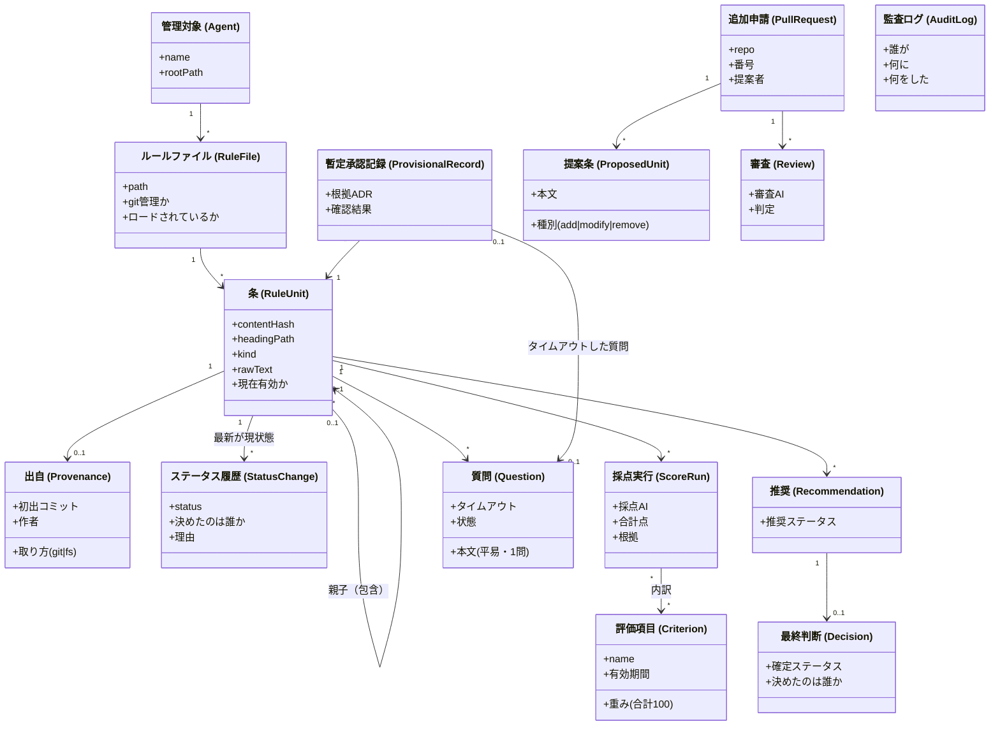
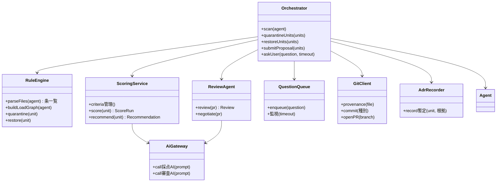
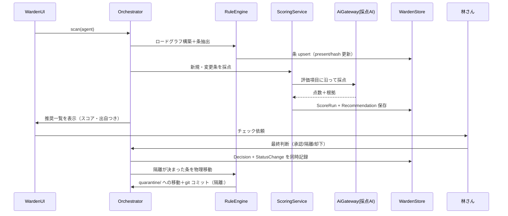
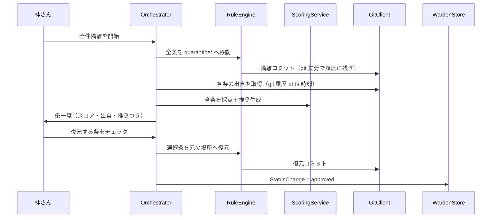
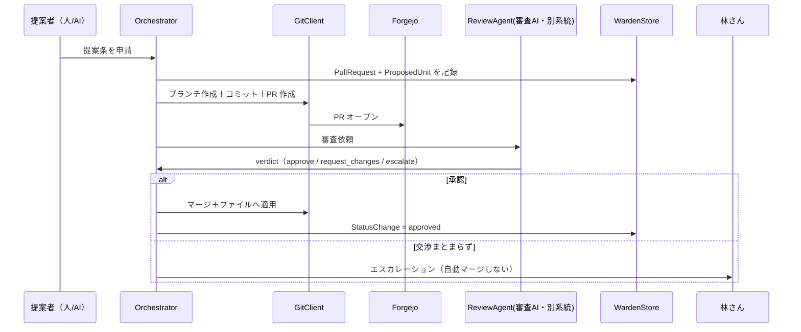
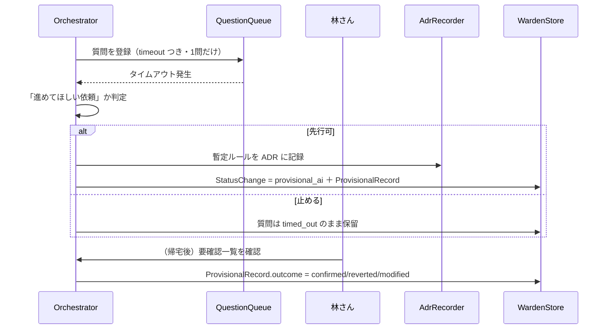

# ADR-0002.5: 要件用語によるクラス図・シーケンス図

- 日付: 2026-10-06
- 状態: ドラフト（林さんレビュー待ち）
- 記録者: Devin
- 位置づけ: ADR-0001（コンポーネント図）と ADR-0003（DDL）の間を埋める。
  要件定義の用語のまま、登場する「もの」と「動き」を決める

## 目的

ADR-0001 のコンポーネント図は「箱と線」でしかない。
ここで各箱をクラスに割り当て、要件で使った言葉（条・隔離・推奨・
最終判断・暫定 AI 承認・要確認一覧……）のまま属性と関係を定義する。
ADR-0003 のテーブルは、このクラス図の永続化対象部分を
そのまま写した形になっている。

## コンポーネント → クラス対応

| ADR-0001 の箱 | クラス | 役割 |
|---|---|---|
| API / オーケストレーター | `Orchestrator` | 全ユースケースの入口・段取り |
| ルールエンジン | `RuleEngine` | 条パーサー（ADR-0002）、隔離・復元の物理移動 |
| 採点サービス | `ScoringService` | 評価項目管理・採点実行・推奨生成 |
| 審査・交渉エージェント | `ReviewAgent` | 別系統 AI による PR 審査 |
| 質問キュー | `QuestionQueue` | 林質問ルールの送出・タイムアウト監視 |
| Git 連携 | `GitClient` | 出自取得・隔離コミット・Forgejo PR |
| ADR 記録 | `AdrRecorder` | 暫定承認の根拠を ADR に書く |
| SQLite | `WardenStore` | 永続化層（ADR-0003 の実装相手） |
| 採点AI / 審査AI（外部） | `AiGateway` | MCP/API の交換可能な抽象層（D8） |
| Web UI | `WardenUI` | 一覧・チェック・質問応答・要確認一覧 |

## クラス図

サービス側（エンティティを操作する箱）:

## シーケンス図

### S1. 定期スキャン → 採点 → 推奨 → 林さん決定（D2・D3）

### S2. 初期復元（デコンタミネーション。D4）

### S3. 追加フロー（D5。提案自由・審査厳格）

### S4. 質問タイムアウト → 暫定 AI 承認（D6）

## ADR-0003 との対応

| クラス | テーブル |
|---|---|
| Agent / RuleFile / RuleUnit / Provenance | agents / rule_files / rule_units / provenance |
| StatusChange | status_history |
| Criterion / ScoreRun | criteria / score_runs(+score_details) |
| Recommendation / Decision | recommendations / decisions |
| Question / ProvisionalRecord | questions / provisional_records |
| PullRequest / ProposedUnit / Review | pull_requests / proposed_units / reviews |
| AuditLog | audit_log |
| 編集による別条の対応 | unit_succession |

## 未決の細部

- `AiGateway` の具体プロトコル（MCP or REST API）とトークン認証の実装
- `Orchestrator` がサービスに直接依存するか、イベント/キュー経由にするか
- `RuleEngine` の隔離・復元が失敗したときのロールバック責務の所在
