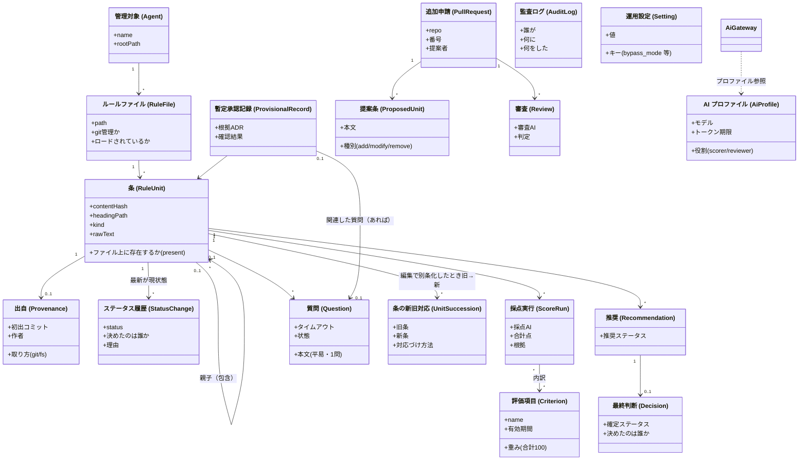
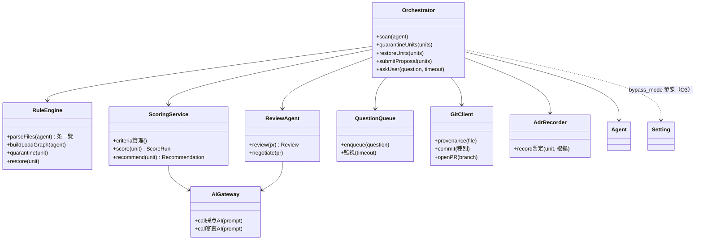
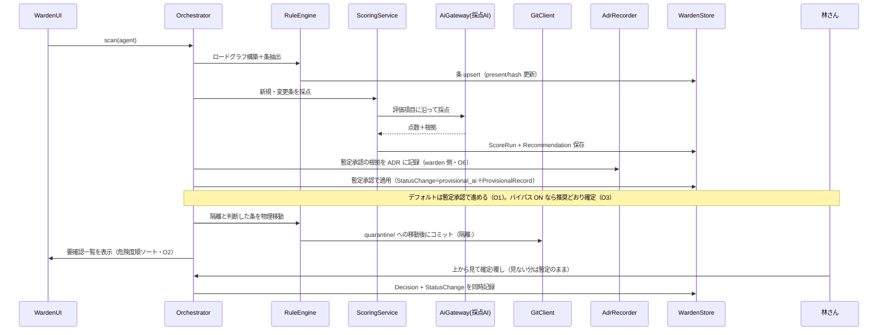
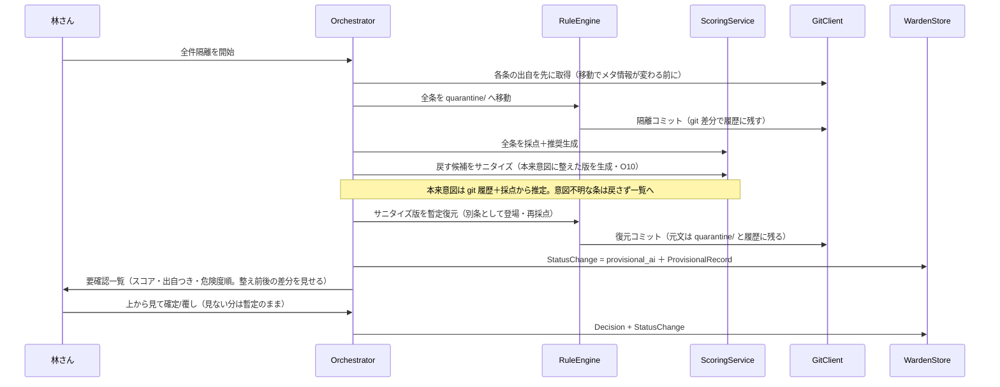
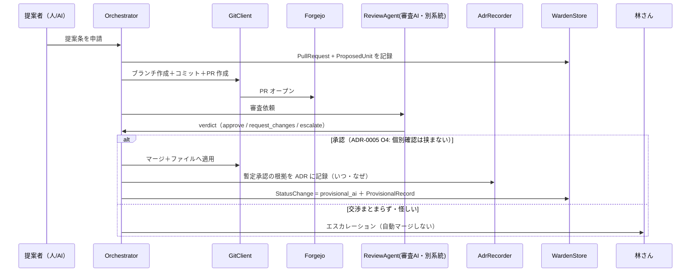
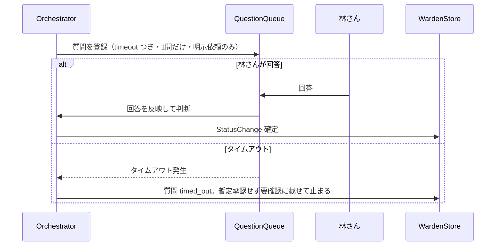

# ADR-0002.5: 要件用語によるクラス図・シーケンス図

- 日付: 2026-10-06
- 状態: ドラフト（林さんレビュー待ち）
- 記録者: Devin
- 位置づけ: ADR-0001（コンポーネント図）と ADR-0003（DDL）の間を埋める。
  要件定義の用語のまま、登場する「もの」と「動き」を決める

## 目的

ADR-0001 のコンポーネント図は「箱と線」でしかない。
ここで各箱をクラスに割り当て、要件で使った言葉（条・隔離・推奨・
最終判断・暫定 AI 承認・要確認一覧……）のまま属性と関係を定義する。
ADR-0003 のテーブルは、このクラス図の永続化対象部分を
そのまま写した形になっている。

用語（条・出自・content_hash・暫定 AI 承認など）は
ADR-0002・0003 の用語集に従う。

## コンポーネント → クラス対応

| ADR-0001 の箱 | クラス | 役割 |
|---|---|---|
| API / オーケストレーター | `Orchestrator` | 全ユースケースの入口・段取り |
| ルールエンジン | `RuleEngine` | 条パーサー（ADR-0002）、隔離・復元の物理移動 |
| 採点サービス | `ScoringService` | 評価項目管理・採点実行・推奨生成 |
| 審査・交渉エージェント | `ReviewAgent` | 別系統 AI による PR 審査 |
| 質問キュー | `QuestionQueue` | 林質問ルールの送出・タイムアウト監視 |
| Git 連携 | `GitClient` | 出自取得・隔離コミット・Forgejo PR |
| ADR 記録 | `AdrRecorder` | 暫定承認の根拠を ADR に書く |
| SQLite | `WardenStore` | 永続化層（ADR-0003 の実装相手） |
| 採点AI / 審査AI（外部） | `AiGateway` | MCP/API の交換可能な抽象層（D8）。採点用・審査用の**別プロファイル**を持ち、「別系統」（D5）の強制場所とする |
| Web検索（外部） | ScoringService 内部の機能（仮の決定: ADR-0005） | 評価項目の定期更新調査 |
| Web UI | `WardenUI` | 一覧・チェック・質問応答・要確認一覧 |

## クラス図

全クラス共通: 状態変化は `Orchestrator` が `AuditLog` に記録する
（図を煩雑にしないため線は省略）。

サービス側（エンティティを操作する箱）:

全サービス共通: 永続化は `WardenStore` 経由（線は省略）。

## シーケンス図

### S1. 定期スキャン → 採点 → 推奨 → 暫定適用 → 要確認一覧（D2・D3・O1/O2）

### S2. 初期復元（デコンタミネーション。D4）

### S3. 追加フロー（D5。提案自由・審査厳格）

### S4. 明示的に質問する例外的経路（D6・ADR-0005 O1）

デフォルトは「質問せず暫定承認で進める」。質問が出るのは、
林さんが依頼時に「確実に質問して」と明示した場合だけ。

参考: デフォルト経路（質問なし）では、AI の推奨を
暫定承認として適用し、`AdrRecorder` で根拠を記録したうえで
要確認一覧に載せる（危険度順ソート・ADR-0005 O2）。

## ADR-0003 との対応

| クラス | テーブル |
|---|---|
| Agent / RuleFile / RuleUnit / Provenance | agents / rule_files / rule_units / provenance |
| StatusChange | status_history |
| Criterion / ScoreRun | criteria / score_runs(+score_details) |
| Recommendation / Decision | recommendations / decisions |
| Question / ProvisionalRecord | questions / provisional_records |
| PullRequest / ProposedUnit / Review | pull_requests / proposed_units / reviews |
| AuditLog | audit_log |
| AiProfile / Setting | ai_profiles / settings |
| 編集による別条の対応 | unit_succession |

## 未決の細部

以下は ADR-0005 で確定または「仮の決定」が付いた。

- ~~PR 審査 OK 後の自動マージ~~ → ADR-0005 O4（暫定承認で取り込み・記録・一覧）
- ~~暫定承認 ADR の置き場所~~ → ADR-0005 O6（warden 側）
- ~~「別系統」の強制場所~~ → ADR-0005 O7（契約済みから別系統で選定）
- `AiGateway` のプロトコル → 仮の決定（実装時選定、抽象層だけ先に作る）
- `Orchestrator` の依存形 → 仮の決定（直接呼び出しで開始）
- `RuleEngine` のロールバック責務 → 仮の決定（RuleEngine が持つ）
- Web 検索 → 仮の決定（ScoringService 内部機能）
